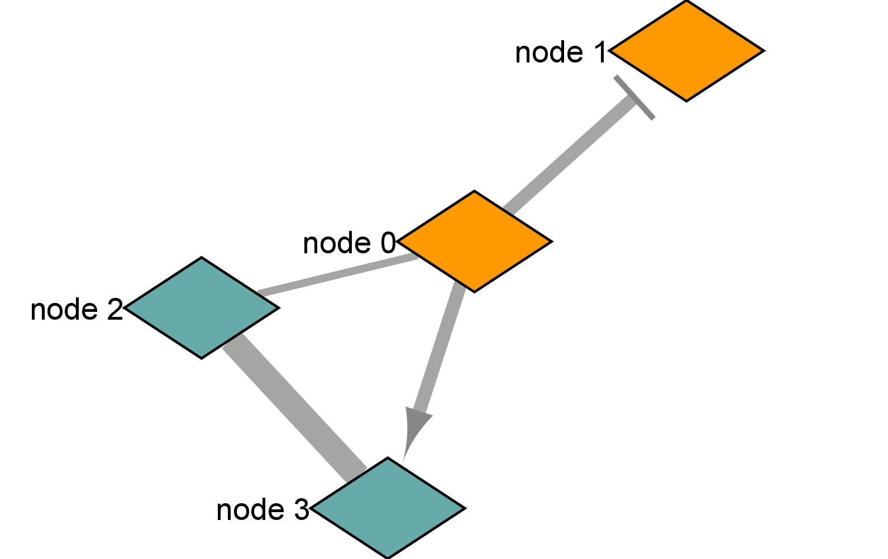
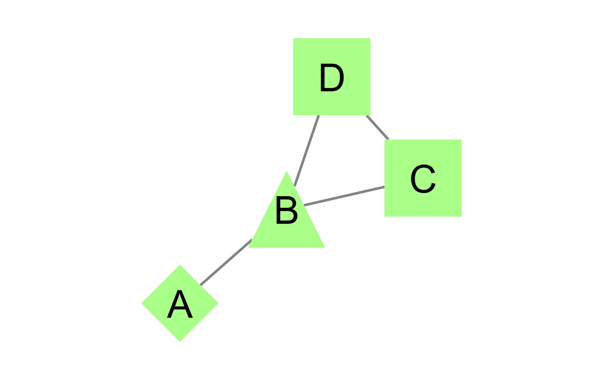

```{r setup, include=FALSE}
knitr::opts_chunk$set(echo = TRUE)
```

# Cytoscape tutorials

Cytoscape is an open source software that is used to visualize (not analyze) networks of interacting molecules, genes, biological pathways, etc. and integrate additional information into these networks, such as annotations, expression profiles, statistical significance of a measurement, and more. These can be integrated using a number of different formats, including changing the color of the node, weight of the connecting edges, highlighting specific nodes, subsetting a network based on certain criteria, and more. There are additional features available through Apps that can be downloaded. 

The following network images were created by following the Cytoscape tutorials "Basic Data Visualization" and "Differentially Expressed Genes" (@cytoscape_tutorials).


## Basic Data Visualization tutorial 

After going through part of the "Basic Data Visualization" tutorial, I created the following large network (saved as a PNG) for the 'galFiltered network with data' data set.


After selecting a small group of genes, the following small network was created.


## Differentially Expressed Genes tutorial

### Workflow 1 - Importing select genes from the STRING Database

The following networks shows the raw network (no GO processes mapping) and final network with the GO processes created from importing the up regulated genes from the gene set provided in the tutorial and applying the specified mappings. The genes were searched in the human STRING database using a protein query with a confidence score of at least 0.4, and the regulation data for all genes were imported from the table provided in the tutorial.


The following networks shows the raw network and final network created from importing the down regulated genes from the gene set provided in the tutorial. The same data and mappings are applied as the up regulated genes except with a blue color mapping to indicate down regulation instead of up regulation.


### Workflow 2 - Importing genes from the STRING Database using a key phrase 

The following networks were created by searching 'ovarian cancer' in the Disease STRING Database and selecting the top 100 human genes with a confidence score of 0.95 or greater. As with Workflow 1, the expression data for the genes was imported from the table provided in the tutorial. 


# Overview of RCy3

The following is the "Overview of RCy3" vignette for the RCy3 package (@RCy3_tutorial). RCy3 is a package that allows users to connect to Cytoscape from within R using CyREST, allowing graphs in R (including data frames) to be used to visualize and manipulate networks in Cytoscape in it's own instance. R is essentially providing Cytoscape the data and telling how to visualize and manipulate the data. This allows for easily and quickly creating reproducible networks and manipulations and even incorporation into workflows.


## 1 - Installation

The installation is simply the same as any other BioConductor package and is shown here for completeness. 

```{r import}
if(!"RCy3" %in% installed.packages()) {
  install.packages("BiocManager")
  BiocManager::install("RCy3")
}
library(RCy3)
```


## 2 - Prerequisites

The RCy3 package requires Cytoscape 3.6.1 or greater. See the Cytoscape website to download the most recent version if necessary.


## 3 - Getting started

Before you can visualize anything with RCy3, you must first launch and keep Cytoscape running by calling the cytoscapePing() function. Calling this and the cytoscapeVersionInfo() function will ensure everything is installed correctly and running properly.

```{r call_cytoscape}
cytoscapePing()
cytoscapeVersionInfo()
```


## 4 - My first network

A network can easily be created from two dataframe objects, one for the nodes and one for the edges, with the following specified formats and then imported to Cytoscape to visualize the network using the createNetworkFromDataFrames() function. 

```{r dataframe_network, eval=FALSE}
nodes <- data.frame(id=c('node 0', 'node 1', 'node 2', 'node 3'),
                   group = c('A','A','B','B'), # Categorical strings for the node grouping
                   score = as.integer(c(20, 10, 15, 5)), # Integers for the node values
                   stringsAsFactors = FALSE)
edges <- data.frame(source=c('node 0', 'node 0', 'node 0', 'node 2'), # Start of edge
                    target = c('node 1', 'node 2', 'node 3', 'node 3'), # End of edge
                    interaction = c('inhibits', 'interacts', 'activates', 'interacts'), # Optional
                    weight = c(5.1, 3.0, 5.2, 9.9), # Numeric for line weights
                    stringsAsFactors = FALSE)

createNetworkFromDataFrames(nodes, edges, title = 'My first network',
                            collection = 'DataFrame Example')
```


### 4.1 - Switch styles

Styles for the network created in Cytoscape can easily be selected from pre-made styles by calling the setVisualStyle() function with the specified pre-made style. For example, let's change the style to Marquee. There is no need to recreate the network - it automatically updates after you apply the new style.

```{r change_style_premade, eval=FALSE}
setVisualStyle('Marquee')
```


### 4.2 - My own style

To create your own custom style, create some R objects that map node visual properties to new options using the mapVisualProperty() function for each property you want to customize. This function takes a visual property that you want to change, maps it to the column in the dataframe for that data, and applies new values for that property. See this functions documentation for much more details about the accepted properties to change, values for the properties, etc. for network visualization. After specifying these new properties, use the createVisualStyle() function with all properties (providing all the new mappings in a list) to create a custom style and apply it with setVisualStyle(). For example, create a new style and apply it to our simple network.

```{r own_style, eval=FALSE}
style.name <- 'myStyle'
defaults <- list(NODE_SHAPE = 'diamond',
                 NODE_SIZE = 30,
                 EDGE_TRANSPARENCY = 120,
                 NODE_LABEL_POSITION = 'W,E,c,0.00,0.00')
nodeLabels <- mapVisualProperty('node label', 'id', 'p')
nodeFills <- mapVisualProperty('node fill color', 'group', 'd', c('A', 'B'), 
                               c('#FF9900', '#66AAAA'))
arrowShapes <- mapVisualProperty('Edge Target Arrow Shape', 'interaction', 'd', 
                                 c('activates', 'inhibits', 'interacts'),
                                 c('Arrow', 'T', 'None'))
edgeWidth <- mapVisualProperty('edge width', 'weight', 'p')

createVisualStyle(style.name, defaults, list(nodeLabels, nodeFills, arrowShapes, edgeWidth))
setVisualStyle(style.name)
```



To set the NODE_WIDTH and NODE_HEIGHT properties independently of each other, you can unlock the node dimensions by specifying lockNodeDimensions(FALSE, style.name).

```{r unlock_node_dims, eval=FALSE}
lockNodeDimensions(FALSE, style.name)
```


## 5 - Bioconductor graph example 

You can also make a network from a Bioconductor graphNEL object. For example, create a 4-node network in R as a graphNEL object and send it to Cytoscape for visualization and layout. To begin, don't include any node attributes or styles. These topics are covered in the next steps.

```{r make_graphNEL}
g <- new('graphNEL', edgemode = 'directed')
g <- graph::addNode('A', g)
g <- graph::addNode('D', g)
g <- graph::addNode('C', g, edges = list('D'))
g <- graph::addNode('B', g, edges = list(c('A', 'D', 'C')))
# No idea why, but it seems you can only make a single network in a knit file 
# since trying to make two throws an error that 'no network view' is selected.
# For some wierd reason, it works in a script but not a knit RMarkdown doc.
createNetworkFromGraph(g, title = "Simple network", collection = 'GraphNEL Example')
```

This should create a basic 4-node network with the default style. Cytoscape has built-in rendering rules that renders the nodes and edges with the default layout algorithm unless specified otherwise. Here is the image of the created network in the default style - 


### 5.1 - Add node attributes

In Cytoscape, we can map different properties of the data to the nodes of the network to more easily visualize and explore the data. There are many other properties that can be used to convey different data values in the network, such as the node shape, fill, line thickness, or size. For example, we can map the node fill to the type of gene that corresponds to each node, the differential expression ratio of that gene, or other property information about a particular node. 

To continue with the simple 4-node graph we have created, let's add two new data values to the nodes - moleculeType and log2fc. The easiest way to do so is through a data.frame object by adding the attributes to the data.frame object and importing the dataframe using loadTableData(). You can also include these attributes in the original graph models as Bioconductor graphs, igraphs, or data.frames and include the properties in the corresponding create functions to make the network. See the other vignettes for this package for more details on how to do so.

```{r add_node_attributes}
df <- data.frame(moleculeType = c('kinase', 'TF', 'cytokine', 'cytokine'),
                 log2fc = c(1.8, 3.0, -1.2, -2.5),
                 row.names = c('A', 'B', 'C', 'D'), # row names = node names
                 stringsAsFactors = FALSE)
loadTableData(df)
```

Note that simply adding the attributes doesn't cause the network appearance to change. You must specify and apply your desired visual style mappings to change the appearance of the graph. You can, however, see the added attributes in the Data Panel in Cytoscape to check that they were imported properly. This panel updates automatically to include the new attributes.


### 5.2 - Modifying the display: defaults and mappings

As shown above in making our own style, RCy3 provides an easy way to change the default styles and easily map properties of each data point to a visual style in a network, such as allowing the size, shape, and color of the nodes and edges to be determined by the data for each of these parts.

For demonstration, let's first change some of the default properties of the network. This is done by a series of set[Property]Default() functions. See the documentation for the accepted values for each of the default visual properties. 

```{r change_defaults}
setNodeShapeDefault('OCTAGON')
setNodeColorDefault('#AAFF88')
setNodeSizeDefault(60)
setNodeFontSizeDefault(30)
```


Now, we will add some visual mappings to our 4-node network using the new data we input. We'll map 'moleculeType' to the node shapes. First, determine the available shapes for Cytoscape using getNodeShapes(), then use the setNodeShapeMapping() to map the different values of moleculeType to different shapes. Similar set[Property]Mapping() functions exist for other visual properties that can be mapped to in a similar fashion.

```{r map_shapes_moleculeType}
getNodeShapes() # Many options, including diamond, triangle, rectangle, ellipse, etc.
column <- 'moleculeType'
values <- c('kinase', 'TF', 'cytokine')
shapes <- c('DIAMOND', 'TRIANGLE', 'RECTANGLE')
setNodeShapeMapping(column, values, shapes)
```



The node shape is an example of a discrete mapping, where the style is defined discretely for each distinct value. This is good for categorical data where there are a limited number of possible values. There are two other types of mappings that constrast with this discrete mapping: continuous and passthrough. Continuous is good for continuous data, or data where the values cover a range of numerical values. For the expression values in our example network, we want to use continuous mapping (to node color, here) since the expression values cover a range of numbers that change continuously. For continuous mapping, we define a small set of control points rather than explicit color values for each possible data point. Cytoscape simply interpolates the colors between the control points to create a color gradient that maps to the expression values. Now, let's map the expression values to a color gradient in a similar way that we mapped the moleculeType to the node shape.

```{r map_color_log2fc}
column <- 'log2fc'
control.points <- c(-3.0, 0, 3.0)
colors <- c('#5588DD', '#FFFFFF', '#DD8855')
setNodeColorMapping(column, control.points, colors)
```


Note how there are three colors and three control points. You can, however, specify two additional colors beyond the number of control points to set extreme (out-of-bounds) colors for values less or greater than the control points. The values should be specified before the lower set point for lower extreme value and after the higher set for the higher extreme value.

```{r map_color_log2fc_extremes}
control.points <- c(-2.0, 0, 2.0)
colors <- c('#2255CC', '#5588DD', '#FFFFFF', '#DD8855','#CC5522')
setNodeColorMapping (column, control.points, colors)
```


Now, let's add a node size mapping, using log2fc again to map to the node size. This is another continuous mapping in the same format as the node color.

```{r map_node_size_log2fc}
control.points <- c(-3.0, 2.0, 3.0) # Note that the set points don't need to be symmetric
sizes <- c(20, 80, 90) # Nor do the values for the mappings
setNodeSizeMapping(column, control.points, sizes)
```


The third type of mapping, passthrough, is already working in our current example network as the node labels. By default, the 'name' column is mapped to the node label property using passthrough logic, as in the value is directly passed through to the style property (label is the same as the node name).


### 5.3 - Selecting nodes

Let's try selecting some nodes in Cytoscape using R. This can be done directly using the selectNodes() function. To begin, let's select the C node by name.

```{r select_C}
selectNodes('C', 'name')
getSelectedNodes()
```


Now, let's extend the selected nodes to include the first neighbors of the already-selected node C. This is a common operation in exploratory network analysis, such as exploring the interactions of nodes selected based on experimental data/annotation to see how these first interacting partners or upstream/downstream partners are affected. To select the first neighbors, use the selectFirstNeighbors() function.

```{r select_first_neighbors}
selectFirstNeighbors()
getSelectedNodes()
```


You can now see that three nodes are selected. To get their names back in R as a list, simply call the getSelectedNodes() function and assign it to an object

```{r first_neighbor_nodes}
node.names <- getSelectedNodes()
node.names
```

Finally, to deselect nodes, use the clearSelection() function.

```{r clear_selected_nodes}
clearSelection()
getSelectedNodes()
```


### 5.4 - Saving and export

Session files in Cytoscape save everything, so if they are opened later, the entire network and all manipulations made are loaded. As with most project software, you should always save often. The network session file made using RCy3 can be saved using the saveSession() function. This will save the file as the input name with the file extension .cys under the current working directory. You can also specify a complete path ending with the desired file name.

```{r save_session, eval = FALSE}
saveSession('data/vignette_session') # Saves as a .cys file
```


### 5.4.1 - Saving high resolution image files

You can also export (save) high resolution images, including vector graphic formats, using the exportImage() function. See the exportImage() documentation (?exportImage()) for full details about the file formats for the images that can be saved.

```{r save_high_res, eval = FALSE}
full.path <- paste(getwd(), 'data/vignette_image', sep = '/')
exportImage(full.path, 'PNG', zoom = 200) # Save a .png scaled by 200%
exportImage(full.path, 'PDF') # Save a .pdf image
```

Here is the PNG image saved from the last network - 


## 6 - Browse available functions, commands, and arguments

RCy3 has many other functions and commands that can be used to interface with Cytoscape in many other ways, including accessing Apps in Cytoscape, manipulating layouts, filtering edges and nodes based on criteria, and more. These can be explored by reading the documentation.

```{r explore_package, eval = FALSE}
help(package = RCy3)
```

You can open swagger docs (a documentation of the API, application programming interface, between R and Cytoscape) for live instances of CyREST API and Commands API using the following commands - 

```{r api_instances, eval = FALSE}
cyrestAPI()
commandsAPI()
```

To view the list of available commands and arguments for the commands in R, use the commandsHelp() function. Starting with 'help' for the top level commands, you can successfully call more commands in the output lists for more details about their arguments. For the commands past the first 'help' command, the 'help' is optional. For example, investigate the network select command using commandsHelp() starting at the top level commands. 

```{r command_help_RCy3}
commandsHelp('help') # For top-level commands
commandsHelp('help network') # For network commands.
commandsHelp('help network select') # View arguments for the network select command
```

This short tutorial covers the basics for network manipulation using RCy3. More vignettes are available through the RCy3 BioConductor website and can be browsed using the browseVignettes("RCy3") command. Additionally, scripts are available at the Cytoscape GitHub repository for RCy3. 

# References