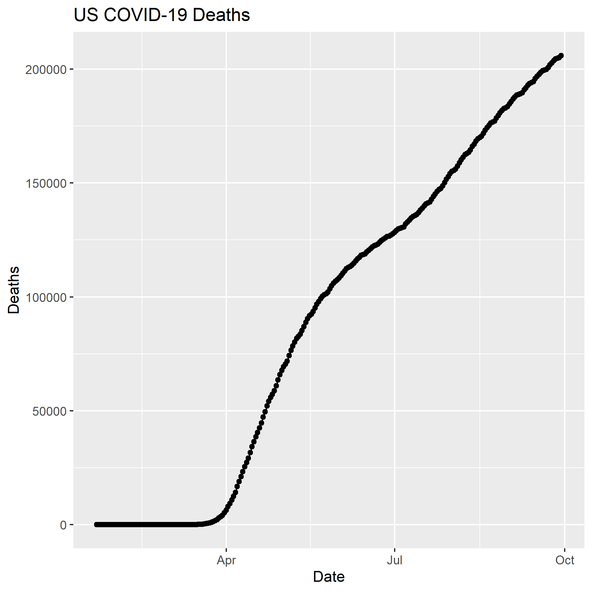
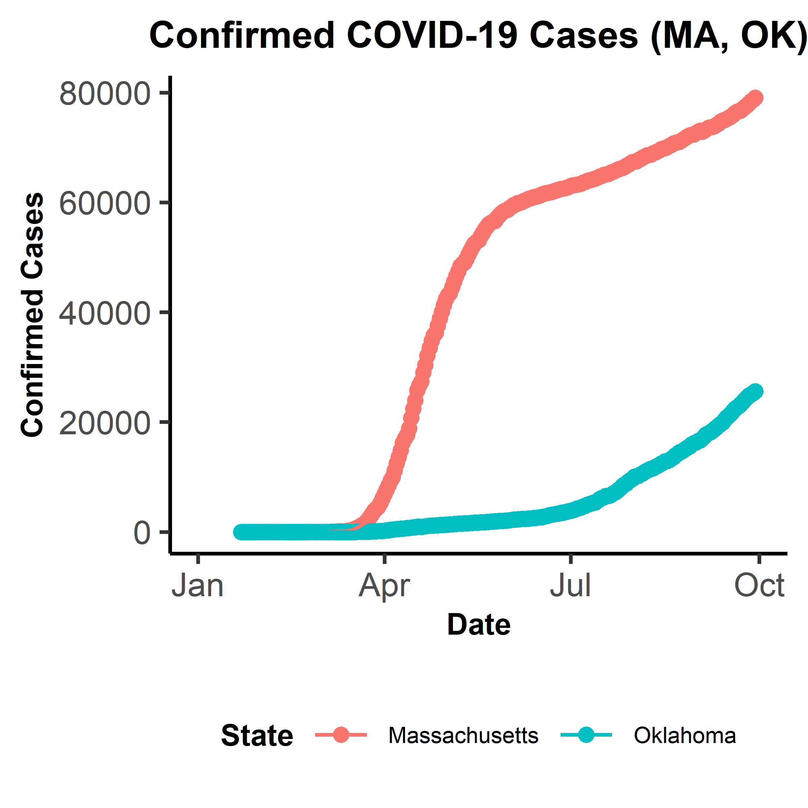

## Lab 5 extra: Interactive Graphs and Animations from COVID-19 report data

# Data for the lab
Load the packages and libraries needed for this lab
```{r importParse}
library(tidyverse)
library(lubridate)
# Read in the global time series data and pivot to long format for the dates
time_series_confirmed_long <- read_csv(url("https://raw.githubusercontent.com/CSSEGISandData/COVID-19/master/csse_covid_19_data/csse_covid_19_time_series/time_series_covid19_confirmed_global.csv")) %>%
  rename(Province_State = "Province/State", Country_Region = "Country/Region")  %>% 
  pivot_longer(-c(Province_State, Country_Region, Lat, Long),
               names_to = "Date", values_to = "Confirmed")
# Now do the same for the death data over time 
time_series_deaths_long <- read_csv(url("https://raw.githubusercontent.com/CSSEGISandData/COVID-19/master/csse_covid_19_data/csse_covid_19_time_series/time_series_covid19_deaths_global.csv")) %>%
  rename(Province_State = "Province/State", Country_Region = "Country/Region")  %>% 
  pivot_longer(-c(Province_State, Country_Region, Lat, Long), 
               names_to = 'Date', values_to = 'Deaths')
# Create the Keys for joining data
time_series_confirmed_long <- time_series_confirmed_long %>% 
  unite(Key, Province_State, Country_Region, Date, sep = '.', remove = FALSE)
time_series_deaths_long <- time_series_deaths_long %>% 
  unite(Key, Province_State, Country_Region, Date, sep = '.')  %>% 
  select(Key, Deaths)
# Now full_join the tables
time_series_long_joined <- full_join(time_series_confirmed_long,
                                     time_series_deaths_long, by = c("Key")) %>% 
  select(-Key)
# Reformat the data to make the date values Date objects
time_series_long_joined$Date  <- mdy(time_series_long_joined$Date)
# Create a Report table with counts like before to graph both Confirmed and Deaths
time_series_long_joined_counts <- time_series_long_joined %>% 
  pivot_longer(-c(Province_State, Country_Region, Lat, Long, Date), 
               names_to = "Report_Type", values_to = "Counts")
```

## Fine tuning ggplots 


You can control the graph size of RMarkdown files in the code chunk {r} using various 
arguments, such as eval = FALSE that will suppress the code execution but will still 
show the code. Alternatively, code = FALSE will exectute the code but not show the 
code. You can also suppress error messages and warnings so the report won't include 
them (although you should still be aware that they exist).
To edit the dimensions of an individual graph, specify the dimensions of the graph 
using fig.width and fig.height

# Graph Output

You can save a plot/figure using a wide variety of different formats. This is good for
controlling the final dimensions in a reproducible way for manuscripts and such.
```{r exportFiles}
# Plot a graph to a pdf output file
pdf('images/time_series_example_plot.pdf', width = 6, height = 3)
time_series_long_joined %>% 
  group_by(Country_Region, Date) %>% 
  summarize_at(c("Confirmed", "Deaths"), sum) %>%  # Recall that summarize_at summarizes for multiple variables
  filter(Country_Region == "US") %>% 
  ggplot(aes(x = Date, y = Deaths)) +
  geom_point() +
  geom_line() +
  ggtitle("US COVID-19 Deaths")
dev.off() # Turn off the input to the PDF file

# Now plot the graph to a png output file, same process
ppi <- 300
png('images/time_series_example_plot.png', width = 6*ppi, height = 6*ppi, res = ppi)
time_series_long_joined %>% 
  group_by(Country_Region, Date) %>% 
  summarize_at(c("Confirmed", "Deaths"), sum) %>% 
  filter(Country_Region == "US") %>% 
  ggplot(aes(x = Date, y = Deaths)) +
  geom_point() +
  geom_line() +
  ggtitle("US COVID-19 Deaths")
dev.off()
# This created a much larger plot with much higher resolution
```


# RMarkdown loading images

Loading images into an Rmd file works with png files, but not pdf files. Other images
can also load images made from other bioinformatic tools into an Rmd report.

This is the RMarkdown style for inserting images
Your image must be in your working directory to work
This command must be put OUTSIDE of the r code chunk



This is the alternative way for using html -
You still must have the image in the working directory or specify the path
The html is put OUTSIDE of the r code chunk, like for RMarkdown


Finally, a third way is to use R code but specify echo = FALSE in the r chunk to 
allow the code output to be displayed but not the code itself


## Interactive Graphs

plotly/ggplotly allow interactive graphs to be made for lab reports.
The two common formats for making graphs is to (1) display the graph directly by
calling the function or (2) point the plot to a variable and call the variable.
An example of (1), where the entire graph production is done at once - 
```{r interactiveGraphs_together}
library(plotly)
ggplotly(
  time_series_long_joined %>% 
    group_by(Country_Region, Date) %>% 
    summarize_at(c("Confirmed", "Deaths"), sum) %>% 
    filter(Country_Region == "US") %>% 
    ggplot(aes(x = Date, y = Deaths)) +
    geom_point() +
    geom_line() +
    ggtitle("US COVID-19 Deaths")
)
```

ggplotly converts a ggplot() object to a plotly object to create an interactive graph.
There are additional arguments beside the ggplot object that can be used to further 
customize the created interactive graph - see documentation for details.

An example of (2), where the graph production is separated into variables and then called -
```{r interactiveGraphs_variables}
# Subset te time series data to include the US deaths
US_deaths <- time_series_long_joined %>% 
  group_by(Country_Region, Date) %>% 
  summarize(Deaths = sum(Deaths)) %>% 
  filter(Country_Region == "US")
# Collect the layers for a graph of the US time series data for COVID deaths
p <- ggplot(data = US_deaths, aes(x = Date, y = Deaths)) +
  geom_point() +
  geom_line() +
  ggtitle("US COVID-19 Deaths")
# Now plot the graph using ggplotly
ggplotly(p) # Same interactive graph
```


## Animated Graphs with gganimate

Animated gganimate graphs are essentially a bunch of files to create a gif, which 
can be used for a report or even saved for use in a slide presentation or something else.
Some important gganimate functions are - 
transition_*() functions define how the data should be spread out and transitions over time. 
view_*() functions define how the positional scales should change with the animation.
shadow_*() functions define how data from other points in time should appear at a given point in time during the animation.
enter_*() and exit_*() functions define how new data should appear and old data disappear in the animation, respectively.
ease_aes() defines how different aesthetics should be eased (moved) during transitions

```{r animations}
# Creating animations 
library(gganimate)
library(transformr)
library(gifski)
theme_set(theme_bw())
# Create an animation of the confirmed cases in select countries
data_time <- time_series_long_joined %>% 
  group_by(Country_Region, Date) %>% 
  summarize_at(c('Confirmed', 'Deaths'), sum) %>% 
  filter(Country_Region %in% c("China","Korea, South","Japan","Italy","US")) 
p <- ggplot(data_time, aes(x = Date, y = Confirmed, color = Country_Region)) +
  geom_point() +
  geom_line() +
  ggtitle("Confirmed COVID-19 Cases") + # Normal ggplot up to this point
  geom_point(aes(group = seq_along(Date))) + # This keeps the points on the graphs by grouping all prior points
  transition_reveal(Date) # Reveal the data over the x-axis variable (Date)
animate(p, renderer = gifski_renderer(), end_pause = 15) # Creates the animation
```

```{r animations_saved, eval = FALSE}
# The output can be saved to a gif to be used elsewhere (like slide presentations) 
# by using anim_save() function. Here is the same animation saved as a gif
anim_save('images/confirmed_5_countries.gif', renderer = gifski_renderer(), p)
```

## Challenge 1
Print a graph (different from the above ones) to a png file using 3*ppi for the 
height and width, then display the png file in the report using RMarkdown format

Let's make a graph showing the number of confirmed cases in MA over time - 
```{r Ch1}
time_series_confirmed_long_MA_OK <- read_csv(url("https://raw.githubusercontent.com/CSSEGISandData/COVID-19/master/csse_covid_19_data/csse_covid_19_time_series/time_series_covid19_confirmed_US.csv")) %>% 
  filter(Province_State == c("Massachusetts", 'Oklahoma')) %>% # States were I and my family live
  select(-c('UID', 'iso2', 'iso3', 'FIPS', "code3", 'Admin2')) %>% 
  pivot_longer(-c(Province_State, Country_Region, Lat, Long_, Combined_Key), names_to = "Date", values_to = "Confirmed") %>% 
  select(c(Province_State, Date, Confirmed)) %>% 
  group_by(Province_State, Date) %>% 
  summarize(Confirmed = sum(Confirmed))
head(time_series_confirmed_long_MA_OK) # Table was created correctly
time_series_confirmed_long_MA_OK$Date <- mdy(time_series_confirmed_long_MA_OK$Date) # Convert Date to Date objects
# Now plot -
plot_MA_OK_Confirmed <- ggplot(time_series_confirmed_long_MA_OK, aes(x = Date, y = Confirmed, color = Province_State)) +
  geom_point() + 
  geom_line() +
  scale_x_date(limits = as.Date(c('2020-01-01', '2020-10-01'))) +
  labs(y = "Confirmed Cases", title = "Confirmed COVID-19 Cases (MA, OK)") +
  scale_color_discrete(name = 'State') +
  theme_classic() +
  theme(axis.title = element_text(face = 'bold', size = 8),
        plot.title = element_text(face = 'bold', hjust = 0.5, size = 10),
        legend.title = element_text(face = 'bold', hjust = 0.5, size = 8),
        legend.text = element_text(size = 6),
        legend.position = 'bottom')
# Now save the graph to a png file with the specifications -
ppi <- 800
png('images/MA_OK_Confirmed.png', width = 3*ppi, height = 3*ppi, res = ppi)
plot_MA_OK_Confirmed
dev.off()
```
Now display the graph via RMarkdown syntax - 


## Challenge 2
Turn an exercise plot from Lab 5 into an interactive graph using plotyly

Take the graph from Exercise 7, which plots the deaths from COVID-19 over time for 
the countries with the top 10 deaths - 
```{r Ch2}
# Format the time series data
time_series_deaths <- read_csv("data/time_series_covid19_deaths_global.csv")%>%
  rename(Province_State = "Province/State", Country_Region = "Country/Region")
# Determine the countries with the highest death totals
deaths_top10 <- time_series_deaths %>% 
  select(-c(Lat, Long)) %>% # Remove the extraneous variables
  group_by(Country_Region) %>% 
  summarize(Total_Latest_Deaths = sum(`9/25/20`)) %>%
  arrange(desc(Total_Latest_Deaths)) %>% 
  slice(0:10)
# Use this data set to filter the time series data 
time_series_deaths_top10 <- time_series_deaths %>% 
  select(-c(Lat, Long)) %>% # Remove the extraneous variables
  filter(Country_Region %in% deaths_top10$Country_Region) %>%  # Filter for top 10 countries by deaths
  pivot_longer(-c(Province_State, Country_Region), names_to = "Date", values_to = "Deaths") %>% 
  group_by(Country_Region, Date) %>% 
  summarize(Total_Deaths = sum(Deaths))
mdy(time_series_deaths_top10$Date) -> time_series_deaths_top10$Date
# Assign the plot to a variable and then use plotyly to create interactive graph
plot_top10_deaths_worldwide <- ggplot(time_series_deaths_top10, aes(x = Date, y = Total_Deaths, color = Country_Region)) +
  geom_point() +
  geom_line() +
  labs(y = "Deaths", title = "COVID-19 Deaths by Country in the Top 10 Countries") +
  scale_x_date(limits = as.Date(c('2020-01-01', '2020-10-01'))) +
  scale_color_discrete(name = "Country") +
  theme(plot.title = element_text(size = 18, face = "bold", hjust = 0.5),
        axis.title = element_text(size = 14, face = "bold"),
        legend.title = element_text(face = 'bold'))
ggplotly(plot_top10_deaths_worldwide)
```

## Challenge 3
Create an animated graph of my choice for the time data to display an aspect that is 
important to me. 
Choosing to graph the total confirmed cases in the states with the top 10 number of 
confirmed cases as of today (29 September 2020) - 
```{r downloadStateData, eval=FALSE}
# Download and format the data -
download.file(url = "https://raw.githubusercontent.com/CSSEGISandData/COVID-19/master/csse_covid_19_data/csse_covid_19_time_series/time_series_covid19_confirmed_US.csv",
              destfile = 'data/time_series_covid19_confirmed_US.csv')
```
```{r formatStateData}
top10_states_confirmed <- read_csv('data/time_series_covid19_confirmed_US.csv') %>%
  group_by(Province_State) %>% 
  summarize(Confirmed=sum(`9/29/20`)) %>% 
  arrange(desc(Confirmed)) %>% 
  slice(1:10)
top10_states_confirmed
```
```{r parseStateData, fig.width=10, fig.height=8}
# Now use the top 10 states to parse the time series data 
time_series_confirmed_top10_states <- read_csv('data/time_series_covid19_confirmed_US.csv') %>%
  filter(Province_State %in% top10_states_confirmed$Province_State) %>% 
  select(-c('UID', 'iso2', 'iso3', 'FIPS', "code3", 'Admin2')) %>% 
  pivot_longer(-c(Province_State, Country_Region, Lat, Long_, Combined_Key), names_to = "Date", values_to = "Confirmed") %>% 
  select(c(Province_State, Date, Confirmed)) %>% 
  group_by(Province_State, Date) %>%
  summarize(Confirmed = sum(Confirmed))
time_series_confirmed_top10_states$Date <- mdy(time_series_confirmed_top10_states$Date)
head(time_series_confirmed_top10_states)
# Now create the plot - 
plot_top10_confirmed_states <- ggplot(time_series_confirmed_top10_states, aes(x = Date, y = Confirmed, color = Province_State)) +
  geom_line() +
  scale_x_date(limits = as.Date(c('2020-01-01', '2020-10-01'))) +
  labs(y = "Confirmed Cases", title = "Confirmed COVID-19 Cases in Top 10 US States") +
  scale_color_discrete(name = 'State') +
  theme_classic() +
  theme(axis.title = element_text(face = 'bold', size = 14),
        plot.title = element_text(face = 'bold', hjust = 0.5, size = 16),
        legend.title = element_text(face = 'bold', hjust = 0.5, size = 14),
        legend.text = element_text(size = 10)) +
  transition_reveal(Date) +
  shadow_trail()
animate(plot_top10_confirmed_states, renderer = gifski_renderer(), end_pause = 20)
```

From this, you can see how the states with the highest number of confirmed cases
have only recently taken the lead due to a massive spike in the number of cases
over the summer (California, Texas, Florida). You can also see how the cases continue
to go up, especially in the states that have recently achieved the highest number of
confirmed cases. You can also see how some of the states with the earliest high
numbers have plateaued (New York, New Jersey) while other states are quickly 
approaching these plateaued states' numbers (Georgia, North Carolina, Tennessee, 
Illinois, Arizona). Also note that Massachusetts is no longer in the top 10. 