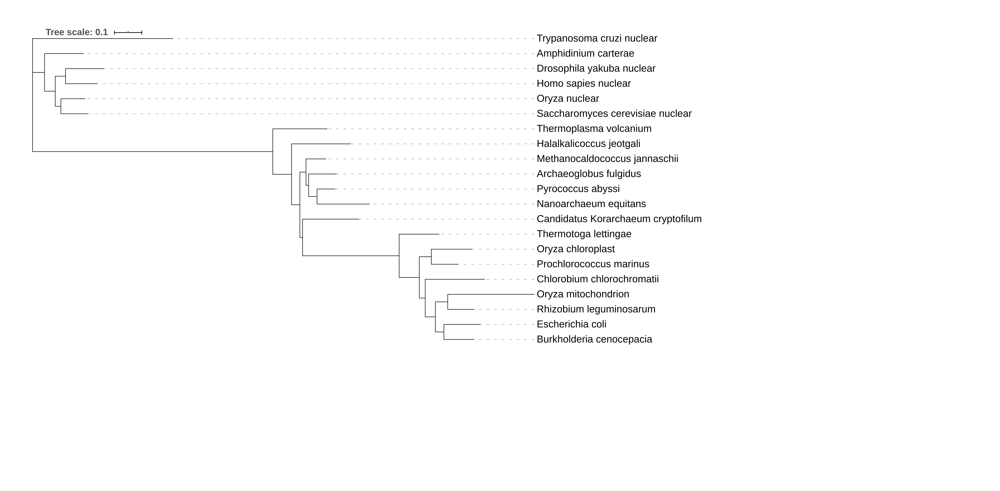
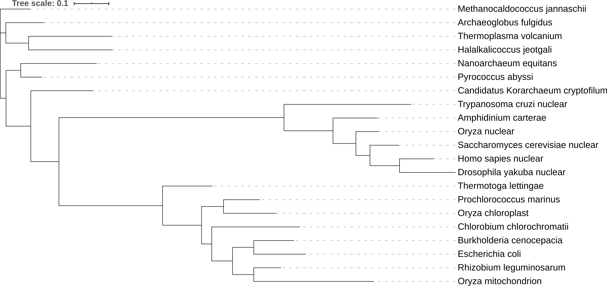
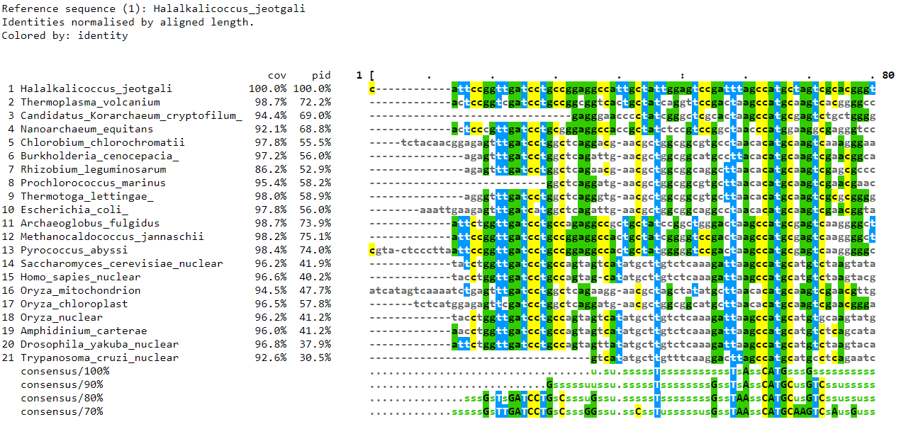

```{r setup, include=FALSE}
knitr::opts_chunk$set(echo = TRUE, message=FALSE, warning = FALSE)
```

# Notes


# Sequence Alignment Background 

Sequence alignment is one of the most fundamental parts of bioinformatics. They are used to determine if genes/proteins are related structurally, functionally, and evolutionarily. There are three principle methods of pair-wise sequence alignemnt - dot matrix analysis,  dynamic programming (DP) algorithm, and word/k-tuple methods (such as BLAST and FASTA).

## Dot matrix analysis

This methods involves creating a matrix of one of the sequences to be compared horizontally running acrossing the bottom while the other is vertically running along the left side.  Each index of the matrix is a measure of the similarity between the two residues on the horizontal and vertical sequencse. The simplest scoring system is identical (dots) and non-identical (blank) residues. 

This dot plot visualizes any possible sequence alignments along the diagonals of the matrix, where dots along y = x indicate homology and dots along other diagonals indicate differences.
Using this method, it is easy to see insertions, deletions, direct repeats, and inverted repeats between the different sequences. For RNA structures, they can also easily show  regions that are self-complementary and, thus, may form secondary structures.

## The dynamic programming algorithm

This optimization algorithm is key to many bioinformatics programs, including BLAST and FASTA for sequence searching, CLUSTALW for multiple sequence alignment, GENSCAN for gene finding, and MFOLD for RNA folding analysis. It takes a complex problem and  transforms it into a series of simpler problems that are optimized within the overall  framework to optimize the overall algorithm. It often requires a variety of different  optimization techniques for the individual problems and creativity to break down the  larger problem into  simpler ones that can be relatively easily optimized.

## Substitution penalties differ for particular nucleotides or amino acids

Because amino acids are put together based on the 3 nt codon sequences and most mutation events involve only changing one nt at a time, single nt mutations for a given codon sequence will only results in certain possible mutation in the amino acid. For example, consider alanine with an RNA codon sequence of GCU. A single nt substitution would only possibly yield six other amino acids based on the genetic code, and most mutations would result in another alanine codon. Each codon (and corresponding amino acid) has its own probability table for these single nt mutations. These probabilities can be accounted for when performing sequence alignments and comparisons to estimate evolutionary distances. 

## Origin of protein substitution matrices and bioinformatics

Protein substitution matrices (above are frequency matrices based solely on simple single nt mutations) were first developed by Margaret Dayhoff, who was interesting in determining the evolutionary relationships of organisms via their protein sequences. From a collection of protein sequences, she and her coworkers created a model of protein evolution and developed a set of widely used substitution matrices. These matrices are often called Dayhoff or PAM (Percent Accepted Mutation) matrices. These and similar matrices are used in many areas of bioinformatics, including BLAST. 

## Natural selection governs which amino acid changes are observed

Natural selection, like mutations, alter the frequency matrices used for sequence alignments. For example, changes that occur between amino acids that have very different biochemical properties are likely to affect the function of a protein, especially if the mutation is in the active site of an enzymatic protein. Therefore, a substitution between biochemically similar amino acids is more likely to occur. Amazingly, the genetic code has evolved to minimize changes between amino acids with very different biochemical properties.

## Accounting for multiple substitutions

As the time between the divergence of two sequences increases, it becomes increasingly harder to account for multiple substitutions at the same sequence locations (aa or nt). PAM protein matrices have been created based on global alignments of closely related proteins. However, these matrices don't work well for alignments for sequences over long evolutionary time scales. Instead, other types of matrices specifically designed to account for these types of mutations are used. One of the most common is BLOSUM (BLOck SUbstitution Matrix - this is a stretch). Both PAM and BLOSUM are given as the probabilities of a transformation on a log-odds score. 


# Multiple Sequence Alignment

Multiple sequence alignments are notoriously difficult for a number of reasons. If the number of sequences to align is very high (several thousand), very long, based on a very short seed sequence, then a lot of memory may be needed to align all the sequences to each other since the number of combinations increases rapidly when the number of sequences increases (n!). This can be difficult even if the sequences are all the same length. However, most are not the same length due to indels that cause gaps and rearrange sequences, so the alignment problem becomes much more complex. 

In most cases, the ideal location of the indel is ambiguous and must be figured out. Unfortunately, to help determine the indel location, the phylogeny of the sequences is first approximated and then the alignments are based on the phylogeny. The alignments are often then used to estimate the phylogeny. However, this is circular, which can easily introduce bias. This is a major challenge that phylogenetics researchers are trying to figure out to do both alignments and phylogeny at the same time. For this class, though, we will be doing the traditional method of aligning and then phylogenetic analysis. 

Progressive alignment methods are efficient enough for large-scale sequence alignments (100s to 1000s). These methods use two steps to align sequences - the first relates the sequences in a guide tree, and the second step builds the multiple sequence alignment by adding sequences sequentially to the growing alignment based on the guide tree. The initial guide tree is usually determined using an efficient clustering method, such as neighbor-joining or UPGMA. Overall, this alignment method starts with the most similar pair and sequentially adds more sequences until the least-similar sequences is added.

The most popular progressive alignment method has been the Clustal family. Many different implimentations/portals, including web applications and local software, are available for use and provide many different parameters available for customization. Clustal Omega is especially common for phylogenetic tree construction.

The basic steps for Clustal alignment are:
Calculate all possible pair-wise alignments, recording the score for each pair.
Calculate the guide tree based on the pairwise distances using the neighbor joining algorithm
Find the two mostly closely relates sequences based on the alignment scores.
Align these sequences using the Smith-Waterman algorithm. This including calculating the consensus of the alignment, replacing the two sequences with the consensus, finding the two next-most closely related sequences (possible a previous consensus sequence). This loop is then iterated until all sequences have been aligned.
Expand the concensus sequences with the (possibly gapped) original sequences
Report the multiple sequence alignment.

## Software for sequence alignment

There are plenty of tools available for both pairwise and mutliple sequence alignments, including BLAST, Clustal, Muscle, and MAFFT. MAFFT is commonly used for very large data sets and where speed is important. See https://www.ebi.ac.uk/Tools/psa/ for tools for pairwise sequence alignment and https://www.ebi.ac.uk/Tools/msa/ for tools for multiple sequence alignment. 


# Phylogenetic analysis

See the slide that were overviewed in class for more details about what this analysis is. Briefly, it involves using sequences from different species/individuals/genes in a species to estimate the evolution of species over time, including estimating common ancestors and evolutionary distances (e.g., the time since the last common ancestor for two species). This often culminates into a phylogenic tree to visualize these evolutionary distances and species clustering based on sequence similarity. Methods to do so are broken up into tree building and tree visualization.

## Phylogentic analysis example data set

This branch of research was started by Carl Woese, who isolated and sequenced ribosomal RNA from a wide range of species (mammals to bacteria and archaea) to discover a new domain of life, Archaea, via sequence alignments of these rRNA and rRNA from a database. Now, sequencing technology and faster computers has made this process much faster and easier. 

For this example, we are given DNA sequences of small subunit ribosomal genes from a wide range of species, taken from Genbank, so we can construct a multiple sequence alignment and run a phylogenetic analysis of the results to show the relationships among the different taxa. 

## NGPhylogeny.fr

This website (from France, hence the .fr) provides a very quick and easy workflow for phylogentic analysis, starting with multiple sequence alignemnt, then phylogenetic analysis, and finally tree visualization. It is good for a quick look at the relationships among small numbers of sequences before doing more in-depth or larger analyses. Recall the steps for phylogenetic analysis - 
1 - Assembling a group of sequences to align
2 - Aligning the seqeunces so that a distance can be calculated between every pairwise sequences. This will change depending on the method you use.
3 - Determining the relationship among the sequences. This will also change depending on the method used.
4 - Visualizing the determined relationships. 
The website allows for very quick analysis via the 'One Click' workflow, where you upload the sequences to align, pick the methods for alignment, analysis, and visualization, and click go. 

In the resulting tree from the alignment, note the numbers on the tree. These represent statistical support for the given relationship. The more robust the relationship, the closer the value is to 1. The (possible horizonal) axis/scale represents the sequence distance. The resulting files from the workflow can be downloaded and used in reports, other application, etc. 

Other sites for easy and quick workflows include NCBI's Genome Workbench, MEGA, and Genious. Because these local alignments become very computationally intensive with medium to large data sets, it is often most practical to run the alignments and phylogenetic analyses on high performance computers, often remotely through high performance centers. 

## Phylogenetic Analysis (tree building) on CIPRES

The CIPRES Science Gateway is a great public resource to build large phylogenetic trees using remote and large computational resources through a web browser. It also runs popular sequence alignment tools, such as ClustalW, Muscle, and MAFFT, and community tree inference tools, including FasttreeML, GARLI, RAxML, PAUP, and MrBayes. 

## Phylogenetic tree visualization 

Many software packages, including some in Python and R, are available to edit and visualize phylogenetic trees for publications and reports. For example, ETE Toolkit can be used to analyze and visualize trees in Python. Most available tools are independent software tools, partially due to the intensity of the tasks (often written in low level languages, such as C, for speed). However, recently, some R packages have been created for phylogenetic analysis. The ape: Analysis of Phylogenetics and Evolution package in R has recently been created and can access multiple sequence alignment and phylogenetic analysis methods. For example, a book for phylogenetic tree analysis and visualization in R was recently published, and a tutorial for ggtree, a package for phylogenetic tree visualization in R, is available. 


# Exercise 1
Use NGPhylogeny.fr to analyze the set of rRNA sequences provided (see the data folder for Tree_of_Life_Core_Sequences.txt). Describe the methods and put the resulting .png file from the analysis in the report. 

Because I wasn't sure which tree inference tool to use, I decided to analyze the data set twice, with a different tree inference tool for each (specifically, FastME and FastTree). The methods used for this simple phylogenetic analysis workflow include - 

1 - Multiple sequence alignment of all the input sequences using MAFFT (Multiple Alignment using Fast Fourier Transform). This program has multiple alignment strategies, each offering their own advantages and disadvantages (such as accuracy vs. speed). Some are classified as progressive methods, which use pairwise alignments to create a guide tree that then guides the alignments between all sequences (see more thorough explanation above). Progressive methods tend to be faster but less accurate. For this tool, the guide tree is created by calculating a distance matrix based on all shared 6-tuples between all sequences. Other strategies are iterative refinement methods, which is essentially an expansion of the progressive method by reconstructing the guide tree and realigning the sequences a number of times until a criteria is met (i.e., max number of iterations). Alignments are more accurate but take longer to finish. Finally, some strategies are classified as iterative refinements methods using weighted sum of pairs (WSP) and consistency scores. In this method, a different objective scoring system is used that evaluated the consistency between multiple and pairwise alignments. This tends to give more accurate alignments in extremely difficult cases. See the documentation for MAFFT for more details.

2 - Alignment curation of the multiple sequence alignment results using BMGE (Block Mapping and Gathering with Entropy). This software selects certain regions of the aligned sequences that are likely to improve the performance of phylogenetic analysis and the construction of phylogenetic trees, such as ambiguous alignment regions. These regions are selection based on an entropy-like scoring system that is weighted using BLOSUM or PAM similarity matrices. The program then trims the regions that don't pass the scoring threshold, leaving the other regions available for further phylogenetic analysis.

3 - Tree inference using either FastME or FastTree. FastME uses distance algorithms to infer phylogenetic distances using balanced minimum evolution. It uses Nearest Neighbor Interchange and Subtree Pruning and Regrafting algorithms, among others. FastTree uses different algorithms to infer phylogenetic distances and create a tree from aligned sequences. First, it uses neighbor joining to get a rough idea of the tree, then uses minimum evolution techniques (nearest-neighbor interchanges and subtree-prune-regraft), like FastME, to create an initial tree. To improve the tree, maximum-likelihood rearrangements are performed using any of a number of different models (i.e., Jukes-Cantor or Jones-Taylor-Thorton). Finally, FastTree runs bootstrap algorithms (Shimodaira-Hasegawa) to estimate the reliability of the tree's structure. See the programs' documentations for more details. 

4 - Finally, the tree is rendered using the Newick display format, which displays a phylogenetic tree using a series of parentheses, commas, semicolons, labels, and numbers.

By running the NGPhylogeny One-Click workflow, exporting the tree to iTol, and slightly modifying the tree's appearances, I got the following trees. The first is the one created using the FastME tree inference software while the second is created from the FastTree software.






# Exercise 2
Align and do phylogenetic analysis of the sequences in CIPRES using MAFFT and FastTreeMP. Download the fastree_result.tre file from the analysis and put the resulting file in the report.

I followed the instruction in the tutorial to use MAFFT and FastTreeMP for the Tree_of_Life.txt dataset to get the resulting fastree_results.tre file. I downloaded it to the my data folder. It follows the Newick file format, which uses parantheses, commas, and semicolons to concisely store information about a tree, with labels and numbers to denote sample names and evolutionary distances, respectively. The file can be found here - 

[Tree of Life FastTree file](data/TOL_fastree_result.tre)

Because this seemed too easy and doesn't show that I analyzed the data, I decided to also view the alignment (the MAFFT output file) using MView like what was shown in the CIPRES tutorial. Here is an image of the first 80 base pairs for the alignment.




# Exercise 3
Go through the Visualizing and Annotating Phylogenetic Trees with R+ggtree tutorial (@phylogenetic_tree_tutorial) that was slightly modified for class and add the steps to the report. 

## The ggtree Package 

ggtree is an R package available through Bioconductor that expands on ggplot2 for visualizing and annotating phylogentic trees and their associated data. See the Bioconductor page for ggtree, ggtree homepage, and ggtree journal article for more details and full documentation for the package. Additionally, useful tutorials for using ggtree in a variety of ways are available on Bioconductor's website in the form of vignettes. 

Now, load the packages for this tutorial.
```{r import, message=FALSE}
library(tidyverse)
# Had to first install ggtree through BiocManager using BiocManager::install('ggtree')
library(ggtree)
# Add the treeio and ggimage libraries
# Like for ggtree, had to first install through BiocManager::install
library(treeio)
library(ggimage)
```

# Tree Import

There are many different styles of formats for storing phylogenetic tree data from the many different software packages that make these trees from multiple sequence alignments. Most tree viewing software, including R packages, focus on Newick and Nexus file formats. In addition to these file formats, ggtree supports Phylip, Jplace, and New Hampshire eXtended file formats. ggtree supports output from BEAST, EPA, HYPHY, PAML, and other phylogenetic analysis softwares. 

To import these data, ggtree has many different parser functions, all in the format of read.[name]. For example, read.tree() is used to parse Newick files and read.beast is used to parse the output from analysis using BEAST. See the documentation for a full list of all available parsing function.

# Basic Trees

To make a basic tree, first import and parse the data to an object. This data will be a made-up phylogeny of 13 samples using the tree_newick.nwk dataset. Calling the object gives some information about the tree itself but doesn't visualize the object.

```{r parse_basic_tree}
tree <- read.tree('data/tree_newick.nwk')
tree
```

Just like with ggplot(), we can create a blank canvas and then add layers to create a detailed plot. You can use the same themes available in ggplot2 to create the tree, or you can use any of the themes that come in the ggtree package. ggtree comes with a special geom function to create basic trees, called geom_tree().

ggtree also comes with the ggtree() function, which creates a basic, blank canvas for the tree by removing all default axes and backgrounds. It is essentially a shortcut for adding the geom_tree() + theme_tree() layers to the data.

```{r blank_tree}
# Build a ggplot with the geom_tree()
ggplot(tree) +  geom_tree() + theme_tree()
# ggtree() is a convenient shortcut to make this blank canvas
ggtree(tree)
```

You can also add a scale bar using the geom_treescale() geom or adding the theme_tree2() theme to ggtree. Recall that this scale displays the predicted amount of genetic change for each of the branches in the tree (with the length of the branches corresponding to the amount of genetic change between the different nodes and leaves). The units of these branch lengths are typically in nt substitutions per site (# nt mutations/length of sequence). Alternatively, the units may be in percent change or some other representative unit.

```{r basic_tree_scale}
# Add a scale to the tree (not an x-axis)
ggtree(tree) + geom_treescale()
# Or, add the entire scale to the x axis with theme_tree2()
ggtree(tree) + theme_tree2()
```

If you want to plot a cladogram instead of the default phylogram, use the branch.length = 'none' argument in ggtree(). Recall that a cladogram just shows the lineages of a set of samples (no scaling) while a phylogram shows the lineages and scales the branch lengths to show evolutionary distance. See ?ggtree for more details about the arguments available for ggtree()

```{r cladogram}
ggtree(tree, branch.length = 'none')
```

From ?ggtree(), you can see that there are options in the '...' argument that are directly passed to ggplot() and include arguments to change the aesthetics of the resulting tree. For demonstration, we will make a cladogram (no scaling) using thick, blue, dotted lines. Note that these options are not mapped using aes().

```{r cladogram_blue}
ggtree(tree, branch.length = 'none', color = 'blue', size = 2, linetype = 3)
```

# Exercise 1 

A slanted phylogenetic tree can be created by specifying 'slanted' in the layout argument for ggtree() - 

```{r slanted_tree}
ggtree(tree, layout = 'slanted')
```

Similarly, a circular tree can be created by specifying 'circular'.

```{r circular_tree}
ggtree(tree, layout = 'circular')
```

To make a circular cladogram (unscaled) with thick red line, specify a number of different arguments specific to ggtree() (branch.length, layout) and ggplot() (color, size).

```{r circular_red_cladogram}
ggtree(tree, branch.length = 'none', layout = 'circular', color = 'red', size = 2)
```

# Other tree geoms

Additional layers can be added using geoms from ggtree. Like with ggplot2, the graph can be stored as an object and layers added sequentially to create the final plot. Like the geoms from ggplot2, each geom can have additional arguments (e.g., color) passed to customize their aesthetics.

```{r tree_geoms}
# Create the basic plot
p <- ggtree(tree)
# Add the node points
p + geom_nodepoint()
# Add the tip points
p + geom_tippoint()
# Finally, add the tip labels
p + geom_tiplab()
```

# Exercise 2
Using additional arguments inside the geom calls for a tree plot, create a phylogeny with the following characteristics - tips labeled in purple; purple-colored diamond tip points; large, semitransparent yellow node points; and a title using + ggtitle()

```{r Ex2}
ggtree(tree) +
  geom_nodepoint(color = 'gold', size = 4, alpha = 0.25) +
  geom_tippoint(color = 'purple', shape = 18) +
  geom_tiplab(color = 'purple') +
  ggtitle('Exercise 2 Figure: An interesting choice of aesthetics.')
```

# Tree annotation

geom_tiplab() adds very basic annotation for the tree, but other functions can be used to make more customized and sophisticated labels. For more detailed examples and explanations than will be given below, see the tree annotation and advanced tree annotation vignettes for ggtree. 

# Internal node number

Some functions for annotating clades (internal nodes) in ggtree require a parameter specifying the internal node number. To get the number for each node, including the tips, we can use the geom_text() function with the "label = node" argument for the aesthetic mapping. This is because the tree stores the node numbering under the 'node' variable in the tree object. We can also adjust the position of the labels so they don't sit on top of the nodes. 

```{r node_numbering}
ggtree(tree) + geom_text(aes(label = node), hjust = -0.3)
```

Another way to determine the node numbering is to use the MRCA() function and giving a vector of taxa (tip) names. The MRCA() function will return the node number of the input taxas' most recent common ancester (MRCA). 

First, re-create the plot so you can choose which taxa you want to use to get the internal node number.

```{r mrca_tree}
ggtree(tree) + geom_tiplab()
```

Now, for demonstration, find the most common ancester for the taxa C and E, then G and H using MRCA(). Notice that the first argument is the data and the second is the list of taxa used to find their most recent common ancestor. You can also specify these taxa using the 'tip' argument.

```{r mrca_node_numbers}
MRCA(tree, c('C', 'E'))
MRCA(tree, c('G', 'H'))
```

Notice that the node number returned match those from the node-labeled tree.

# Labeling clades

The geom geom_cladelabel() can be used to add another geom layer to annotate a select clade with a bar and associated label. You can select the clade using the internal node number for the node that connects all the taxa in that clade. 

Let's annotate the clade with the most recent common ancester for taxa C and E, which corresponds to the internal node 17. Make the clade red using the 'color' argument and label it using the 'label' argument.

```{r clade_CE}
ggtree(tree) +
  geom_cladelabel(node = 17, label = 'Some random clade', color = 'red')
```

Now, add the tip labels. Offset the clade label slightly using the 'offset' argument to make sure it doesn't clash with the tip labels. You may need to adjust this more or less depending on the labels

```{r clade+tip_labels}
ggtree(tree) +
  geom_tiplab() +
  geom_cladelabel(node = 17, label = 'Some random clade', color = 'red2', offset = 0.8)
```

Now, add another label for the clade containing both G and H taxa.

```{r two_clade_labels}
ggtree(tree) +
  geom_tiplab() +
  geom_cladelabel(node = 17, label = 'Some random clade', color = 'red2', offset = 0.8) +
  geom_cladelabel(node = 21, label = 'A different clade', color = 'blue', offset = 0.8)
```

However, now we have two problems. The first is that the labels are unaligned with each other (which would look better), and the second is that the clade labels are too long and are falling off the edge of the plot. 

The first can easily be fixed by specifying 'align = TRUE' to the geom_cladelabel() function when creating the clade labels.

The second problem is more difficult to fix. This problem is occuring because the original plot layout isn't long enough to incorporate these long clade labels, which are just added as a layer to the layout and then getting cut out due to their location and size. The default layout tries to optimize the plot by plotting the tree over the entire region of the plot. To fix this issue, do the following - 
1 - Create a generic layout of the plot using ggtree(tree)
2 - Add some tip labels
3 - Add each clade label
4 - Add an xlim() layer to the graph to extend the x-axis of the entire plot. It is useful to first call the theme_tree2() theme to show the length of the default x axis for tree, then extend the axis accordingly.
5 - Comment out the theme_tree2() code or add another layer on top of the plot to remove the axis, such as theme_tree() or theme(axis.line.x = element_blank(), axis.text = element_blank()).

```{r clade_labels_extend_axes}
ggtree(tree) +
  geom_tiplab() +
  geom_cladelabel(node = 17, label = 'Some random clade', color = 'red2', offset = 0.8,
                  align = TRUE) +
  geom_cladelabel(node = 21, label = 'A different clade', color = 'blue', offset = 0.8,
                  align = TRUE) +
  theme_tree2() +
  xlim(0,72) + 
  theme_tree() 
  # could also do this code - 
  # theme(axis.line.x = element_blank(), axis.text = element_blank())
```

Instead of labeling the tips of clades, they can be highlighted with the geom_hilight() geom. As usual, see the help for the options available for this geom.

```{r highlight_clade}
ggtree(tree) + 
  geom_tiplab() +
  geom_hilight(node = 17, fill = 'gold') + 
  geom_hilight(node = 21, fill = 'purple')
```


# Connecting taxa

Some evolutionary events, such as reassortment or horizontal transfer of genes, can be displayed by simpling connecting nodes on a tree. These connections can be added using the geom_taxalink() geom to draw straight or curverd lines between any two nodes on the tree. There is a vignette available for more details about this geom.

```{r connect_taxa}
ggtree(tree) + 
  geom_tiplab() +
  geom_taxalink('E', 'H', color = 'blue3') + # Note that the default is a curved line
  geom_taxalink('C', 'G', color = 'orange2', curvature = -0.9)
```

# Exercise 3 

Reproduce the figure from the tutorial page by doing the following - 
1 - Find the MRCA for taxa B and C and also taxa L and J
2 - Draw the tree using ggtree(tree)
3 - Add tip labels
4 - Highlight the clades with separate colors (match the colors in the figure)
5 - Add a clade label to the larger superclade (node 17) that includes A, B, C, D, and E. Name it "Superclade 17' and color it red. It will likely need to be offset
6 - Link taxa C to E and G to J with a dashed gray line
7 - Add a scale bar to the bottom by changing the theme
8 - Add a title (matching the Exercise 3 figure)
9 - Optionally, go to the original ggtree(tree) call and change the layout to circular to see what happens.

```{r EX3}
mrca_BC = MRCA(tree, 'B', 'C') # Node 19
mrca_LJ = MRCA(tree, 'L', 'J') # Node 23
ggtree(tree) + 
  geom_tiplab() + 
  geom_highlight(node = mrca_BC, fill = 'blue') + 
  geom_highlight(node = mrca_LJ, fill = 'orange') +
  geom_cladelabel(node = 17, label = 'Superclade 17', color = 'red3', offset = 0.8) +
  geom_taxalink('C', 'E', color = 'gray35', linetype = 2) + 
  geom_taxalink('G', 'J', color = 'gray35', linetype = 2) + 
  theme_tree2() + 
  labs(title = "Exercise 3 title: Not sure what we're trying to show here...")
```

```{r EX3_circular}
ggtree(tree, layout = 'circular') + 
  geom_tiplab() + 
  geom_highlight(node = mrca_BC, fill = 'blue') + 
  geom_highlight(node = mrca_LJ, fill = 'orange') +
  geom_cladelabel(node = 17, label = 'Superclade 17', color = 'red3', offset = 7, vjust = 1.1) +
  # Note that the circular tree doesn't support taxa linking and doesn't create a 
  # proper axis for the evolutionary distance, so these elements were removed
  labs(title = "Exercise 3 title: Not sure what we're trying to show here... (circular)")
# In my opinion, the labels and highlight are rendered better on a normal rectangular tree
```

# Advanced tree annotation

Let's use previously published data from Liang, et al., 2014 that was reanalyzed in the ggtree paper (@ggtree_tutorial_data_paper). The subset of data contains 76 H3 hemagglutinin gene sequences containing both swine and human influenza A virus sequences. The data set was reanalyzed using BEAST (Bayesian Evolutionary Analysis Sampling Trees), which gives a rooted, time-measured phylogeny that is inferred using molecular clock models. 

First, read the data using read.beast() since the input data is the output from a BEAST analysis. Add a time scale bar using theme_tree2(), then change the x-axis units from genetic distance to dates supplying the most recent sampling date to the ggtree() call. This is done by setting the mrds argument to the most recent date in 'YYYY-MM-DD' format in the ggtree() call. Then, add some tip labels to the tree. Right-align the labels and adjust the dotted lines to reduce their sizes. Finally, adjust the x-axis to show between 1990 and 2020 to make sure the labels don't fall off the graph. Like before, the MRCAs and node number can be obtained to properly annotate everying using the MRCA() function or labeling all the nodes. 

```{r flu_tree_advanced, fig.height=10}
# Read the data
tree <- read.beast('data/flu_tree_beast.tree')
# Supply the most recent sampling dates to the ggtree() call 
# and add a time scale bar
flu_tree <- ggtree(tree, mrsd='2013-01-01') +
  theme_tree2()
# Add the tip labels and adjust the axis
flu_tree + 
  geom_tiplab(align = TRUE, linesize = 0.5) +
  xlim(1990, 2020)
```

Finally, lets look at the msaplot() function using ?msaplot. This function puts the multiple sequence alignment and tree side by side for comparison. Specifically, the function takes a tree object (made by ggtee()) and the path to the the FASTA file for the multiple sequence alignment to create the plot. It can be used for the entire multiple sequence alignemnt or just a fraction of it. The coordinates system can be changed to a circular tree by passing the coord_polor(theta = 'y') layer to the graph (not shown here).

```{r msa_tree_plot, fig.height=10}
msaplot(p = ggtree(tree), fasta = 'data/flu_aasequence.fasta', window = c(150, 175))
```

More information about advanced tree annotation and pretty much the entire ggtree package can be found by reading the ggtree documentation and published article and going through the many ggtree vignettes at the BioConductor website. 


# Bonus!

See the ggtree vignettes for details about how these bonus features work. 

# Many trees

ggtree allows many trees to be ploted at once in a facet wrap, just like ggplot2. To show this, let's create 3 replicates of 4 random trees with 10, 25, 50, and 100 tips, then plot them all

```{r facet_trees, fig.height=7, fig.width=9}
set.seed(42) # Set the seed for the generation of the random seed for consistancy
trees <- lapply(rep(c(10, 25, 50, 100), 3), rtree) # Make the random trees, 3 each size
class(trees) <- 'multiPhylo' # Change the class of the set of trees to multiPhylo to plot
ggtree(trees) + facet_wrap(~.id, scale = 'free', ncol = 4) +
  ggtitle("Many trees. Such phylogenetics. Wow") # Make the faceted trees
# I did not expect this title. I like it
```

# Plot tree with other data

You can also plot other data alongside a tree using the facet_plot() function. This function accepts a data.frame and geom function to draw the input data.

```{r tree_with_other_data, fig.height=5, fig.width=7}
# Generatre a random tree with 30 tips
tree <- rtree(30)
# Make the original tree plot
p <- ggtree(tree)
# Generate some random values (from a normal distr.) for each tip label in the tree data
d1 <- data.frame(id = tree$tip.label, val = rnorm(30, sd=3))
# Make a second plot with the tree plot, naming the new plot 'dot',
# using the data that was just created with a point geom
p2 <- facet_plot(p, panel = 'dot', data = d1, geom = geom_point, aes(x = val), color = 'red3') # Note that this adds the 'dot' panel to the right of tree plot in its own facet
# Now, make some more data for the tree points, using normal dist. with diff mean and SD
d2 <- data.frame(id = tree$tip.label, value = abs(rnorm(30, mean = 100, sd = 50)))
# Finally, add these new data to the second plot as another facet.
# This time, use a bar segment graph, size 3, color blue.
p3 <- facet_plot(p2, panel = 'bar', data = d2, geom = geom_segment, 
                 aes(x = 0, xend = value, y = y, yend = y), size = 3, color = 'blue4')
# Display the three plots with a scale for each plot
p3 + theme_tree2()
```

# Overlay organism silouhettes

phylopic.org has many free silhouette images for different organisms, all of which are under the Creative Commons or Public Domain. ggtree allows these images to be overlain on the plot at a node of your choice.

```{r overlay_silouhette}
# Get phylopic data
newick <- "((Pongo_abelii,(Gorilla_gorilla_gorilla,(Pan_paniscus,Pan_troglodytes)Pan,Homo_sapiens)Homininae)Hominidae,Nomascus_leucogenys)Hominoidea;"
# Read the data
tree <- read.tree(text = newick)
# Get the images and specify the masses of each species to color the images
d  <- ggimage::phylopic_uid(tree$tip.label)
d$body_mass = c(52, 114, 47, 45, 58, 6)
# Plot and add the images, colored by their masses
p <- ggtree(tree) %<+% d + # I think this operator adds mass and image data to the plot
  geom_tiplab(aes(image = uid, colour = body_mass), geom = 'phylopic', offset = 2.5) +
  geom_tiplab(aes(label = label), offset = 0.2) + # Add the text labels (above was images)
  xlim(NA, 7) +
  scale_color_viridis_c()
p
```

## Exercise 4
Upload and visualize the tree file from the FastTreeMP output creating on CIPRES. Use treeio to read the data and ggtree to visualize the tree. Color the tree according to the domains of life.

```{r EX4_basic}
TOL_tree <- read.tree('data/TOL_fastree_result.tre')
# Determine the nodes for the domains based on the species in the tree
tree_plot <- ggtree(TOL_tree) +
  geom_tiplab(align = TRUE, linesize = 0.5) + 
  xlim(0, 1.75)
tree_plot
# For eukaryotes, Drosophilia and Trypanosoma share the base common root
# For bacteria, Thermotoga and E. coli share a common base root
# For Archaea, Candidatus korarchaeum and Archaeoglobus share a common base root
# These will be used to determine the nodes for each domain
```

```{r EX4_colored}
# First, determine the MRCA for all domains
mrca_euk = MRCA(TOL_tree, 'Drosophila_yakuba_nuclear', 'Trypanosoma_cruzi_nuclear')
mrca_bac = MRCA(TOL_tree, 'Thermotoga_lettingae_', 'Escherichia_coli_')
mrca_arch = MRCA(TOL_tree, 'Candidatus_Korarchaeum_cryptofilum_', 'Archaeoglobus_fulgidus')
# Now, add the highlights for each domain of life
colored_tree <- tree_plot +
  geom_highlight(mrca_arch, fill = 'orange2') + # Archaea
  geom_highlight(mrca_euk, fill = 'purple') + # Eukarya
  geom_highlight(mrca_bac, fill = 'green', alpha = 0.35, extend = 0.22) # Bacteria
colored_tree
```

Note how the extend argument of the highlight geom for bacteria was used to extend the highlight to cover the dotted line of the tree (to cover the orange highlight over the entire tree due to the Archaea highlight). Additionally, the bootstrap values for all nodes could be displayed using the nodelab() geom (geom_nodelab()).

For fun, here is the same highlighted tree (this time a cladogram to clearly show the branches) in circular form - 

```{r EX4_circular, fig.height = 6, fig.width = 6}
circle_TOL_tree <- ggtree(TOL_tree, branch.length = 'none', layout = 'circular') +
  geom_tiplab(align = TRUE) +
  xlim(0,38) +
  geom_highlight(mrca_arch, fill = 'orange2') + # Archaea
  geom_highlight(mrca_euk, fill = 'purple') + # Eukarya
  geom_highlight(mrca_bac, fill = 'green', extend = 0.22) # Bacteria
circle_TOL_tree
```

# References