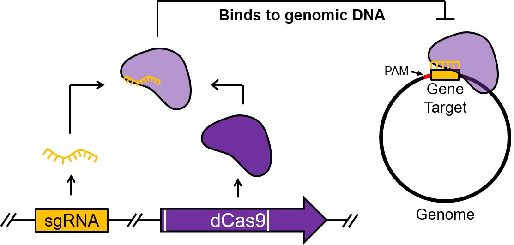

```{r setup, include=FALSE}
knitr::opts_chunk$set(echo = TRUE)
```

Website repository for my lab reports and other files for the Evolutionary Genomics and Bioinformatics course in Fall 2020.

## What I do


 



## Lab Reports
* Lab 1: [Lab 1](Lab1_SNC.html)
* Lab 2: [Lab 2](Lab2_SNC.html)
* Lab 3a: [Lab 3a](Lab3a_SNC.html)
* Lab 3b: [Lab 3b](Lab3b_SNC.html)

All lab reports are written in R [@RCoreTeam].

# REFERENCES